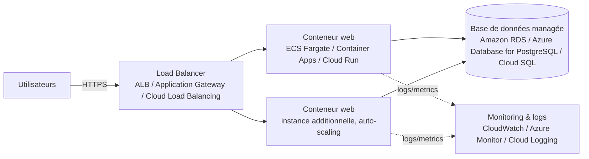

# Formy — mini-projet Docker multi-services

Formy est un assistant numérique qui transforme les démarches administratives
françaises (CAF, impôts, France Travail, CPAM, préfecture...) en checklists
claires : vraies étapes, vrais délais, documents requis et pièges à éviter.
Ce dépôt contient une implémentation conteneurisée du projet, réalisée dans
le cadre du mini-projet "Déploiement conteneurisé multi-services".

## Scénario technique choisi

- **Conteneur 1 — `web`** : une API REST Node.js / Express (build multi-stage,
  image finale `node:20-alpine`, exécution en utilisateur non-root) qui sert
  aussi le frontend (HTML/CSS/JS, rendu partiellement côté serveur pour le
  référencement).
- **Conteneur 2 — `db`** : une base **PostgreSQL 16**, seule source de vérité,
  non exposée sur l'hôte.
- **Conteneur 3 (bonus) — `pgadmin`** : interface d'administration graphique
  de la base de données.

L'API expose l'authentification (cookies httpOnly + refresh token), le
catalogue des démarches (137 fiches réparties dans 17 catégories, avec un
lexique intégré pour expliquer les sigles administratifs), le regroupement
par événements de vie (19 situations : naissance, perte d'emploi,
déménagement, majorité...), le suivi de progression (checklist par étape,
statuts à faire / en cours / terminé, échéances) et des fonctionnalités RGPD
(export et suppression de compte).

## Lancer le projet

Prérequis : Docker et Docker Compose installés.

**1. Configurer les variables d'environnement** (obligatoire — le projet
refuse volontairement de démarrer sans un secret JWT défini, voir la section
Bonnes pratiques) :

```bash
cp .env.example .env
```

Puis générez un secret et collez-le dans `.env` à la place de
`JWT_SECRET=REMPLACEZ_MOI_PAR_UNE_VALEUR_ALEATOIRE_LONGUE` :

```bash
node -e "console.log(require('crypto').randomBytes(32).toString('hex'))"
```

(Aucun Node.js sur la machine ? `openssl rand -hex 32` fonctionne aussi.)
Toutes les autres variables ont déjà une valeur par défaut fonctionnelle.

**2. Construire et lancer les 3 conteneurs :**

```bash
docker compose up -d --build
```

Au premier démarrage, l'API :
1. attend que Postgres soit prêt (`healthcheck` + retries applicatifs) ;
2. applique les migrations SQL versionnées (schéma, index de recherche,
   RGPD, lexique) ;
3. charge automatiquement le catalogue de démarches, catégories, événements
   de vie et lexique (jeu de données initial) ;
4. crée un compte administrateur (`admin@formy.fr` / `ChangeMe123!` par
   défaut, modifiable via `.env`).

**URLs à tester :**

| Service                  | URL                                |
|---------------------------|-------------------------------------|
| Application Formy         | http://localhost:8080              |
| API (santé)                | http://localhost:8080/api/health   |
| pgAdmin                    | http://localhost:8081              |

Pour se connecter à pgAdmin à la base `db` : hôte `db`, port `5432`,
utilisateur/mot de passe définis dans `.env` (par défaut `formy` / `formy`).

Pour arrêter :

```bash
docker compose down
```

Pour tout arrêter **et supprimer les données** (recommencer de zéro) :

```bash
docker compose down -v
```

## Persistance des données

Un volume Docker nommé `formy_db_data` est monté sur
`/var/lib/postgresql/data` dans le conteneur `db`. Cela garantit que les
comptes utilisateurs, le catalogue de démarches et les suivis de progression
survivent à un redémarrage ou une recréation du conteneur `db` — seule la
suppression explicite du volume (`docker compose down -v`) efface les
données. Un second volume (`formy_pgadmin_data`) conserve de la même façon
la configuration de pgAdmin.

## Bonnes pratiques Cloud / Docker mises en œuvre

- **Build multi-stage** dans `backend/Dockerfile` : les dépendances sont
  installées (`npm ci`, reproductible via `package-lock.json`) dans une
  étape `builder`, puis seule l'image de production (allégée,
  `node:20-alpine`) est conservée avec le code et les modules déjà installés.
- **Exécution sans les droits root** : un utilisateur système dédié `formy`
  est créé et utilisé (`USER formy`) pour exécuter le processus Node.js.
- **Secrets via variables d'environnement, avec échec explicite si absents** :
  aucun mot de passe n'est en dur dans le code ou l'image ; ils sont injectés
  par `docker-compose.yml` / `.env` (voir `.env.example`). Le conteneur `web`
  refuse même de démarrer si `JWT_SECRET` n'est pas défini
  (`${JWT_SECRET:?...}`), plutôt que de retomber silencieusement sur une
  valeur par défaut non sécurisée.
- **Base de données non exposée** : le service `db` ne publie aucun port sur
  l'hôte, il n'est joignable que par les autres conteneurs via le réseau
  interne créé automatiquement par Compose.
- **Healthchecks** sur `db` et `web`, utilisés par `depends_on: condition:
  service_healthy` pour séquencer proprement le démarrage.
- **Service bonus pertinent** : pgAdmin (administration de la base).

## Initialisation automatique

- Le **schéma** de la base (tables, contraintes, index, extension
  `pg_trgm`) est géré par des **migrations SQL versionnées**
  (`db/migrations/001_*.sql` à `004_*.sql`), exécutées automatiquement par
  l'API au démarrage (`backend/src/migrate.js`) et trackées dans une table
  `schema_migrations` — une mise à jour du code peut ainsi faire évoluer le
  schéma d'une instance déjà déployée, pas seulement d'une base neuve.
- Le **jeu de données initial** (catégories, événements de vie, démarches,
  étapes, lexique) et le **compte administrateur** sont créés par un script
  applicatif au démarrage de l'API (`backend/src/seed/seed.js`), de façon
  idempotente (upsert) : il se resynchronise à chaque redémarrage sans
  dupliquer les données ni écraser la progression des utilisateurs.

## Schéma d'architecture Cloud (production)

En production, cette architecture serait déployée sur un Cloud public de la
façon suivante :



- **Accès utilisateur** : un Load Balancer (AWS ALB, Azure Application
  Gateway ou GCP Cloud Load Balancing) termine le TLS et répartit le trafic
  HTTPS vers les instances du service `web`.
- **Hébergement des conteneurs** : le service `web` est déployé sur un
  service de conteneurs managé (AWS ECS Fargate, Azure Container Apps ou
  Google Cloud Run), avec auto-scaling horizontal selon la charge — il n'y a
  alors plus de conteneur `db` local, ni de secrets en clair : ceux-ci
  seraient stockés dans un gestionnaire de secrets managé (AWS Secrets
  Manager, Azure Key Vault, GCP Secret Manager).
- **Base de données** : remplacée par un service managé (Amazon RDS pour
  PostgreSQL, Azure Database for PostgreSQL ou Google Cloud SQL), avec
  sauvegardes automatiques et haute disponibilité multi-zone.

## Conformité au cahier des charges

| Exigence du cahier des charges | Statut |
|---|---|
| 2 conteneurs communicants minimum (API + BDD) | ✅ `web` (Express) + `db` (PostgreSQL) |
| Dockerfile : image de base légère | ✅ `node:20-alpine` |
| Dockerfile : dépendances installées | ✅ `npm ci` |
| Dockerfile : port exposé | ✅ `EXPOSE 3000` |
| Dockerfile : build multi-stage | ✅ étapes `builder` / `production` |
| Compose : mapping de ports du service web | ✅ `8080:3000` |
| Compose : variables d'environnement sécurisées pour la BDD | ✅ via `.env` |
| Init automatique : compte admin + jeu de données | ✅ `backend/src/seed/seed.js` |
| Persistance : volume Docker pour la BDD | ✅ `formy_db_data` |
| Réseau : BDD non exposée sur l'hôte | ✅ `db` sans `ports:` |
| README : scénario + commandes exactes | ✅ ce document |
| README : justification de la persistance | ✅ section dédiée ci-dessus |
| README : bonnes pratiques Cloud/Docker | ✅ section dédiée ci-dessus |
| README : schéma d'architecture Cloud | ✅ diagramme Mermaid ci-dessus |
| Bonus : build multi-stage | ✅ |
| Bonus : 3ᵉ service pertinent | ✅ (2 fournis : Mailhog + pgAdmin) |
| Bonus : services cloud managés dans le schéma | ✅ RDS/Cloud SQL, ALB, Secrets Manager |
