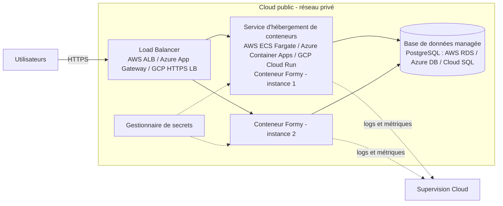

# Formy — mini-projet Docker multi-services

Formy est un assistant numérique qui transforme les démarches administratives
françaises (CAF, impôts, France Travail, CPAM, préfecture...) en checklists
claires : vraies étapes, vrais délais, documents requis et pièges à éviter.
Ce dépôt contient une implémentation conteneurisée du projet, réalisée dans
le cadre du mini-projet "Déploiement conteneurisé multi-services".

## Scénario technique choisi

- **Conteneur 1 — `web`** : une API REST Node.js / Express (build multi-stage,
  image finale `node:20-alpine`, exécution en utilisateur non-root) qui sert
  aussi le frontend (HTML/CSS/JS, rendu partiellement côté serveur pour le
  référencement).
- **Conteneur 2 — `db`** : une base **PostgreSQL 16**, seule source de vérité,
  non exposée sur l'hôte.
- **Conteneur 3 (bonus) — `pgadmin`** : interface d'administration graphique
  de la base de données.

L'API expose l'authentification (cookies httpOnly + refresh token), le
catalogue des démarches (137 fiches réparties dans 17 catégories, avec un
lexique intégré pour expliquer les sigles administratifs), le regroupement
par événements de vie (19 situations : naissance, perte d'emploi,
déménagement, majorité...), le suivi de progression (checklist par étape,
statuts à faire / en cours / terminé, échéances) et des fonctionnalités RGPD
(export et suppression de compte).

## Lancer le projet

Prérequis : Docker et Docker Compose installés.

Il faut avoir Git, Docker et Docker Compose installés. Si le dépôt est privé, il faut également accepter l’invitation GitHub et être connecté à son compte.

1. Dans PowerShell, clone le dépôt. 

   ```powershell
   git clone https://github.com/gbetiefs-byte/formy.git
   cd formy
   ```

2. Crée le fichier `.env` à partir de l’exemple :

   ```powershell
   Copy-Item .env.example .env
   ```

   Génère un secret JWT avec Node.js :

   ```powershell
   node -e "console.log(require('crypto').randomBytes(32).toString('hex'))"
   ```

   Copie le résultat et remplace dans `.env` la valeur de `JWT_SECRET` par ce secret. Docker Compose refuse de démarrer l’application si cette variable est absente. Node.js sert ici uniquement à générer le secret ; l’application elle-même tourne dans Docker.

3. Construis et démarre les services :

   ```powershell
   docker compose up -d --build
   ```

4. Ouvre l’application dans ton navigateur : **http://localhost:8080**

| Service | Adresse |
|---|---|
| **Application Formy** | **http://localhost:8080** |
| Vérification de l’API | http://localhost:8080/api/health |
| pgAdmin | http://localhost:8081 |

Les identifiants administrateur et pgAdmin sont configurables dans `.env`. Les valeurs fournies dans `.env.example` sont prévues pour le développement : change-les avant toute utilisation réelle. Pour ouvrir la base depuis pgAdmin, utilise l’hôte `db`, le port `5432` et les identifiants PostgreSQL renseignés dans `.env`.

Pour arrêter les services sans supprimer les données :

```powershell
docker compose down
```

Pour arrêter les services et supprimer aussi les données persistées :

```powershell
docker compose down -v
```

## Architecture

Docker Compose démarre trois services :

- **`web`** : API Node.js et Express, qui sert aussi l’interface HTML, CSS et JavaScript. Le port local `8080` est redirigé vers le port `3000` du conteneur.
- **`db`** : PostgreSQL 16. La base n’expose pas de port sur la machine hôte ; elle est accessible aux autres services sur le réseau Docker.
- **`pgadmin`** : interface graphique d’administration de PostgreSQL, accessible sur le port local `8081`.

Le Dockerfile utilise une construction multi-stage basée sur `node:20-alpine` et lance le service web avec un utilisateur non privilégié. Des contrôles de santé vérifient la disponibilité de PostgreSQL et de l’API.

## Données et initialisation

### Persistance

Le système de fichiers d’un conteneur est éphémère : sans volume, les comptes, les checklists et la progression des utilisateurs disparaîtraient à chaque recréation du conteneur `db` (mise à jour d’image, `docker compose up --build`, etc.). C’est pourquoi deux volumes nommés ont été créés :

- **`formy_db_data`**, monté sur `/var/lib/postgresql/data` : conserve toutes les données PostgreSQL entre les arrêts ou les recréations de conteneurs.
- **`formy_pgadmin_data`**, monté sur `/var/lib/pgadmin` : conserve la configuration de pgAdmin (serveurs enregistrés, préférences).

Seule la commande `docker compose down -v` supprime ces volumes.

Les migrations SQL versionnées se trouvent dans `db/migrations/` et sont appliquées au démarrage de l’API. Les données de référence et le compte administrateur sont initialisés automatiquement. Les démarches et le lexique sont synchronisés au démarrage.

## Bonnes pratiques Cloud / Docker implémentées

- **Build multi-stage** : un stage `builder` installe les dépendances (`npm ci --omit=dev`), puis l’image finale `node:20-alpine` n’embarque que le nécessaire, ce qui la rend plus légère.
- **Exécution sans droits root** : le conteneur `web` tourne avec un utilisateur dédié `formy`.
- **Secrets et configuration par variables d’environnement** : mots de passe, `JWT_SECRET` et paramètres sont lus depuis `.env` (non versionné) ; Compose refuse de démarrer si `JWT_SECRET` est absent.
- **Healthchecks et ordre de démarrage** : `web` attend que `db` soit sain (`depends_on: condition: service_healthy`).
- **Base non exposée** : PostgreSQL n’a aucun port publié sur l’hôte, seul le réseau interne Docker y accède.

## Sécurité et configuration

Les paramètres sont transmis aux conteneurs par variables d’environnement définies dans `.env`. Le secret JWT est obligatoire. En revanche, les mots de passe d’exemple ne sont pas adaptés à un déploiement réel : il faut les remplacer et ne pas publier le fichier `.env`.

FranceConnect est facultatif. Pour l’activer, il faut renseigner dans `.env` les paramètres du client (`FC_CLIENT_ID`, `FC_CLIENT_SECRET`, `FC_ISSUER` et `FC_REDIRECT_URI`).

## Évolution possible vers le Cloud

Pour un déploiement en production, je remplacerais la base locale par un PostgreSQL managé, je stockerais les secrets dans le gestionnaire du fournisseur Cloud et je placerais un répartiteur HTTPS devant plusieurs instances de l’application.



Cette architecture peut s’appuyer sur AWS, Azure ou Google Cloud : le Load Balancer reçoit le trafic HTTPS, le service de conteneurs managé exécute l’image Docker `web` (plusieurs instances), et la base PostgreSQL managée remplace le conteneur `db` local avec sauvegardes automatiques.

## Crédits

**Projet réalisé par Fresnel Gbetie, avec l’accompagnement d’Axel Houenou.**
